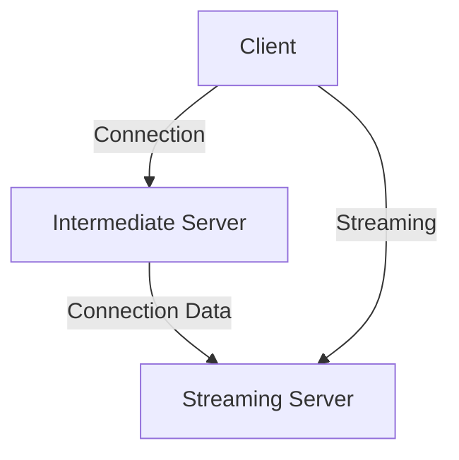

# MediaBridge 🎵 

> MediaBridge is a media player that enables streaming of multimedia files anywhere with an internet connection. Final degree project for Technical Engineering in Computer Management at Pablo de Olavide University of Seville (Year 2009).
## 📑 Table of Contents
- [Description](#-description)
- [Features](#-features)
- [System Requirements](#-system-requirements)
- [Initial Setup](#-initial-setup)
- [Architecture](#-architecture)
- [Usage](#-usage)
- [Technologies Used](#-technologies-used)
- [Project Status](#-project-status)
## 📝 Description
MediaBridge is an application designed to unify all your devices in a secure personal network, allowing you to access your multimedia files from anywhere. You can play your multimedia files remotely without needing to store them locally.
## ✨ Features
- 🎵 Local playback of multimedia files (MP3, AVI)
- 🌐 Remote multimedia file streaming
- 🔄 Integrated client/server functionality
- 🎮 Basic playback controls (play, pause, stop)
- 🔊 Volume control
- 🐦 Twitter integration for sharing playback status
- 📁 Shared folder management
## 💻 System Requirements
- Windows Operating System
- Java Runtime Environment
- GStreamer Framework
- Apache Server
- Hamachi (for VPN)
- `C:\ConfigStreaming` folder with read/write permissions
## 🔧 Initial Setup
1. Install Apache web server
2. Install Hamachi to create VPN between PCs
3. Create `C:\ConfigStreaming` folder with necessary permissions
4. Configure Apache server ports
5. (Optional) Configure htdocs folder for streaming
## 🏗 Architecture
### Hardware

### Software
- Developed in Java
- 3-layer design pattern:
  - Graphical interface
  - Business logic
  - Persistence (planned for future versions)
- Implementation of Factory and Strategy patterns
## 🚀 Usage
1. Configure Apache server and select folder to share
2. Start the streaming server
3. From the client, connect to the server using the IP
4. Select multimedia files to play
## 🛠 Technologies Used
- Java (main language)
- GStreamer (multimedia framework)
- Apache (web server)
- Hamachi (VPN)
- Twitter API (social integration)
## 📊 Project Status
This project is in version 0.1-alpha. Known limitations:
- Playback time not shown in interface
- Progress bar not implemented
- Issues with streaming playlist
- Manual IP configuration needed in absence of intermediate server
## 🔜 Future Improvements
- Database implementation
- Migration of configuration files to XML
- Support for more multimedia formats
- User interface improvement
- Implementation of intermediate server
- Cross-platform support
---
*Developed by Joaquín Gutiérrez Gil - Pablo de Olavide University*
