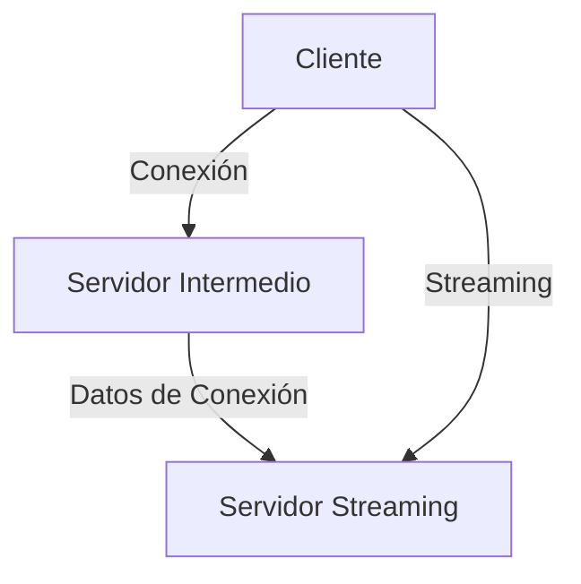

# MediaBridge 🎵 

> MediaBridge es un reproductor multimedia que permite realizar streaming de archivos multimedia en cualquier lugar donde tengamos una conexión a internet. Proyecto final de carrera de Ingeniería Técnica en Informática de Gestión de la Universidad Pablo de Olavide de Sevilla (Año 2009).

## 📑 Tabla de Contenidos
- [Descripción](#-descripción)
- [Características](#-características)
- [Requisitos del Sistema](#-requisitos-del-sistema)
- [Configuración Previa](#-configuración-previa)
- [Arquitectura](#-arquitectura)
- [Uso](#-uso)
- [Tecnologías Utilizadas](#-tecnologías-utilizadas)
- [Estado del Proyecto](#-estado-del-proyecto)

## 📝 Descripción

MediaBridge es una aplicación diseñada para unificar todos tus dispositivos en una red personal y segura, permitiéndote acceder a tus archivos multimedia desde cualquier lugar. Puedes reproducir tus archivos multimedia de forma remota sin necesidad de tenerlos almacenados localmente.

## ✨ Características

- 🎵 Reproducción local de archivos multimedia (MP3, AVI)
- 🌐 Streaming de archivos multimedia remotos
- 🔄 Funcionalidad cliente/servidor integrada
- 🎮 Controles básicos de reproducción (play, pause, stop)
- 🔊 Control de volumen
- 🐦 Integración con Twitter para compartir estado de reproducción
- 📁 Gestión de carpetas compartidas

## 💻 Requisitos del Sistema

- Sistema Operativo Windows
- Java Runtime Environment
- GStreamer Framework
- Servidor Apache
- Hamachi (para VPN)
- Carpeta `C:\ConfigStreaming` con permisos de lectura/escritura

## 🔧 Configuración Previa

1. Instalar servidor web Apache
2. Instalar Hamachi para crear VPN entre PCs
3. Crear carpeta `C:\ConfigStreaming` con permisos necesarios
4. Configurar puertos del servidor Apache
5. (Opcional) Configurar carpeta htdocs para el streaming

## 🏗 Arquitectura

### Hardware

### Software
- Desarrollado en Java
- Patrón de diseño de 3 capas:
  - Interfaz gráfica
  - Lógica de negocio
  - Persistencia (planificada para futuras versiones)
- Implementación de patrones Factory y Strategy

## 🚀 Uso

1. Configurar el servidor Apache y seleccionar carpeta a compartir
2. Arrancar el servidor de streaming
3. Desde el cliente, conectar al servidor usando la IP
4. Seleccionar archivos multimedia para reproducir

## 🛠 Tecnologías Utilizadas

- Java (lenguaje principal)
- GStreamer (framework multimedia)
- Apache (servidor web)
- Hamachi (VPN)
- Twitter API (integración social)

## 📊 Estado del Proyecto

Este proyecto se encuentra en versión 0.1-alpha. Algunas limitaciones conocidas:

- No se muestra el tiempo de reproducción en la interfaz
- La barra de progreso no está implementada
- Problemas con la lista de reproducción en streaming
- Necesidad de configuración manual de IP en ausencia de servidor intermedio

## 🔜 Futuras Mejoras

- Implementación de base de datos
- Migración de archivos de configuración a XML
- Soporte para más formatos multimedia
- Mejora en la interfaz de usuario
- Implementación de servidor intermedio
- Soporte multiplataforma

---

*Desarrollado por Joaquín Gutiérrez Gil - Universidad Pablo de Olavide*
